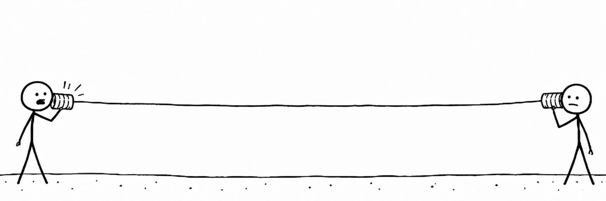

<p align="center">
  
</p>

# Actor Engine — KoL actor runtime prototype v0.1.0

A Go + ASH actor-driven state plane for **monitoring and safely operating around KoLmafia**, designed to plug into Kolmaf-AI Desktop while preserving the existing authority model.

> **Evidence is not authority.** Live verification proves only the operations named below. It does not grant install, restart, arbitrary ASH/gCLI, account, social, or live game-mutation authority.

## Live verification checkpoint — 2026-09-29

`release.stage` is now **live-validated for v0.1.0** at hardened commit [`a7e9136`](https://github.com/donCannoli-burns/actor-engine/commit/a7e9136b732229b5463466e5b236ef66e9d4cf58).

The real KoLmafia runtime test covered both sides of the confirmation contract:

```text
UNCHANGED STATE
proposal → exact-state confirmation → execute → verified local staging

CHANGED STATE
proposal → confirmation → observation changes → 409 reject
                                            ↓
                                  approval invalidated
                                            ↓
                                  retry = proposal not found
```

Verified during the live run:

- `go test ./...` — PASS
- `go test -race ./...` — PASS
- `go vet ./...` — PASS
- Go sidecar build — PASS
- GitHub Actions CI for `a7e9136` — PASS
- KoLmafia observation through `kol_actor.ash` — PASS
- Kingdomsitter observation — PASS
- installed KoLmafia revision remained `29301`
- official latest release observed as `r29309`
- stale-state execution returned `409` and burned the approval
- immediate retry returned `proposal not found`
- failed/invalid staging left no committed artifact
- successful stage produced `KoLmafia-29309.jar`
- independent SHA-256 matched GitHub exactly: `c40cfe77bba26591d9f054b6e276998e9c60f61dfba1feb95e7cf2dfa6ccfc0b`
- no `.part-*` file remained after successful staging
- state plane activated `release_staged`
- staging did **not** install or restart KoLmafia

The live run also found and repaired a real bug in the original staging path: a timed-out download could leave a partial JAR under the final filename. Commit `a7e9136` changed staging to **temporary file → complete transfer → SHA-256 verification → sync/close → atomic rename**, with cleanup on failure, and changed stale-state consume failures to invalidate the prior approval.

Full evidence, commands, observed outcomes, and authority boundary: [`docs/LIVE-VERIFICATION.md`](docs/LIVE-VERIFICATION.md).

## What this prototype does

- runs a local Go actor supervisor on `127.0.0.1:10424`;
- monitors the official KoLmafia latest-release API;
- can inspect an installed KoLmafia JAR manifest for `Build-Revision`;
- monitors the proven Kingdomsitter Go/ASH sidecar on `127.0.0.1:10423`;
- accepts bounded KoLmafia observations from `kol_actor.ash`;
- represents runtime facts as **concurrently active states** rather than one giant edge-defined FSM;
- exposes one protocol to Go, Rust, Kotlin, C#, C++, C, and Swift clients;
- implements a state-bound human confirmation gate;
- implements one reversible write: **atomically stage a KoLmafia release artifact** into a local staging directory and verify SHA-256 when GitHub supplies a digest;
- deliberately does **not** implement release install, restart, arbitrary gCLI, or arbitrary ASH execution.

## Authority boundary

### Live-validated in v0.1.0

- observation-only ASH → Go state publication;
- release metadata discovery;
- proposal creation bound to a state digest;
- explicit human confirmation against that digest;
- stale-state rejection and approval invalidation;
- atomic, digest-verified local release staging;
- receipt/state reconciliation after successful staging.

### Not validated and not authorized

- release installation;
- KoLmafia restart;
- arbitrary ASH execution;
- arbitrary gCLI execution;
- login/logout/account switching;
- live in-game mutation;
- social/chat/trade automation.

Restart semantics are intentionally fail-closed in v0.1.0: pending proposals are in-memory and disappear on Actor Engine restart. Cached release metadata also requires refresh after restart.

## Why Go + ASH

Kingdomsitter already demonstrates the useful split: Go owns orchestration/tooling while KoLmafia/ASH remains the runtime-facing language surface. This prototype extends that pattern into an actor state plane rather than creating another game client.

## Run

```bash
./scripts/smoke.sh
go run ./cmd/kol-actor-engine \
  -kolmafia_jar /path/to/KoLmafia-29309.jar
```

Then inspect:

```bash
curl http://127.0.0.1:10424/health
curl http://127.0.0.1:10424/v1/state
curl -X POST http://127.0.0.1:10424/v1/release/refresh
```

Install `kolmafia/scripts/kol_actor.ash` into KoLmafia's scripts directory, then:

```text
kol_actor status
kol_actor sync
```

## KoLmafia checkout

The repository is KoLmafia-package-aware. Its root `manifest.json` points KoLmafia at `kolmafia/`, so checkout installs only the runtime-facing ASH/data shim and does not project the Go or multi-language development tree into KoLmafia directories.

From KoLmafia gCLI:

```text
git checkout https://github.com/donCannoli-burns/actor-engine.git main
```

Then install/start the Go sidecar separately:

```bash
go install github.com/donCannoli-burns/actor-engine/cmd/kol-actor-engine@latest
kol-actor-engine
```

Verify from KoLmafia:

```text
kol_actor status
kol_actor sync
```

Update later with `git update actor-engine`. See [`docs/KOLMAFIA-CHECKOUT.md`](docs/KOLMAFIA-CHECKOUT.md) for the full install/update/remove split.

## Release staging flow

```bash
# 1. refresh live release metadata
curl -X POST http://127.0.0.1:10424/v1/release/refresh

# 2. create proposal
curl -X POST http://127.0.0.1:10424/v1/proposals/release-stage \
  -H 'content-type: application/json' -d '{}'

# 3. human reviews proposal and copies BOTH proposal id + state_digest
curl -X POST http://127.0.0.1:10424/v1/proposals/<id>/confirm \
  -H 'content-type: application/json' \
  -d '{"state_digest":"<digest>","confirmed_by":"human"}'

# 4. execute exactly that confirmed proposal
curl -X POST http://127.0.0.1:10424/v1/proposals/<id>/execute
```

The result is a staged file + receipt. KoLmafia is not installed, restarted, logged in/out, or commanded.

## Multi-language clients

The `clients/` directory contains minimal protocol clients for:

- Rust
- Kotlin/JVM
- C#/.NET
- C++20
- C11/POSIX
- Swift/Foundation

They are transport clients, not authority domains. All policy and execution decisions remain in the Go supervisor.

## Integration with Kolmaf-AI Desktop

Desktop project page: https://doncannoli-burns.github.io/kolmaf-ai-desktop/  
Actor Engine page inside the Desktop site: https://doncannoli-burns.github.io/kolmaf-ai-desktop/actor-engine.html  
Desktop repository: https://github.com/donCannoli-burns/kolmaf-ai-desktop

See `integration/kolmaf-ai-desktop-tools.fragment.json`. It mirrors the desktop tool-manifest style but keeps this prototype's authority at `proposal-and-confirmed-local-staging-only`.

## Reference mapping

This build was grounded against the uploaded KoL App-Dir Matrix, Kingdomsitter's current Go/ASH boundary, Kolmaf-AI Desktop's current trust model, and the official KoLmafia release API. See `docs/REFERENCE-MAP.md` and `FOR-AGENT.html`.

## License

MIT. See [`LICENSE`](LICENSE).
